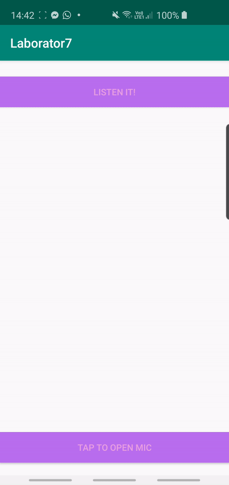

EXERCISE 1

The first exercise consisted in creating a textView and two buttons: 
- TAP TO OPEN MIC button to make speech to text
- LISTEN button to be abble to hear the text, meaning a Text-To-Speech button

I have followed the tutorial from this link https://www.tutorialspoint.com/android/android_text_to_speech.htm  to make the buttons do what the task says, meaning:

The first button, when pressed, allows you to speak into the microphone and listens to your voice using an intent named RecognizerIntent - this asks for speech input and then sends it through speech recognizer. The chosen language is English and the speech is turned into string and added to textView.
The second button ( i have named it LISTEN IT!), when pressed, has the functionality to translate the text received from the first into into speech, depending on the language ( different languages come with different accents). In order to use the textToSpeech class, according to the tutorial, I had to create an object and specify further properties for the speech inside it ( ex from code: t1.setLanguage(Locale.UK); ). The problem I had with this at first was that when pressed, the text wouldn't be turned into speech. I have solved this by getting rid of the class onPause() which existed in the tutorial from this link : https://www.tutorialspoint.com/android/android_text_to_speech.htm . Everything worked after that. ^_^

EXERCISE 2

This exercise consisted in following a tutorial on Fragments. Fragments run within an activity. For this exercise I have created a second activity containing fragments, linked to the first one using the second button (LISTEN IT!) therefore when the button is clicked, it opens the second activity. 
As I understood from the given information, fragments are kind of a sub-activity. It has its own layout, the difference is made in using onCreateView() callback. 
I have created two fragments which extend the Fragment class as shown in the second activity. They are declared in the activity's layout file, as a <fragment> element. They both have a basic structure containting only a textView. Also, I have used fragments transaction to be able to move from one fragment to another. The tutorial I have followed is https://examples.javacodegeeks.com/android/core/app/fragment/android-fragments-example/ .

 
Advantages in using fragments:
- multiple fragments can be combined in the same activity, therefore you can create a multi-pane user interface;
- its life cycle is related to that of the host which means that when the activity stops, all the fragments in the activity stop;

HERE IS A GIF OF HOW THE LAB WORKS: 

                                                  
                                                   
                                                   
                                                   
                                                   
                                                   
                                                   
                                                   
                                                   
       
